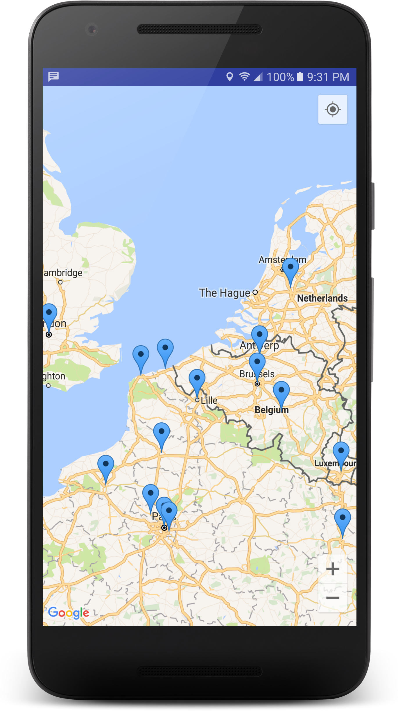
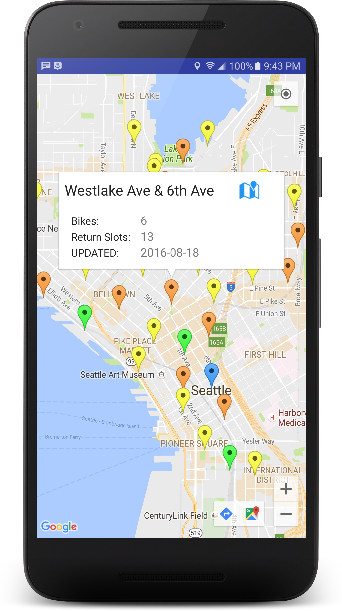

# MapTest
learning the google maps v2 API for android

### Resources
uses CityBikes open source bikeshare API
https://citybik.es/#about

### How to use
If you intend on using this you will need to create a file at /res/values/google_maps_api.xml
like so:

```
<resources>
    <!--
    TODO: Before you run your application, you need a Google Maps API key.

    To get one, follow this link, follow the directions here:
    https://developers.google.com/maps/documentation/android/start#get-key

    Once you have your key (it starts with "AIza"), replace the "google_maps_key"
    string in this file.
    -->
    <string name="google_maps_key" templateMergeStrategy="preserve" translatable="false">YOUR_KEY_HERE</string>
</resources>
```



